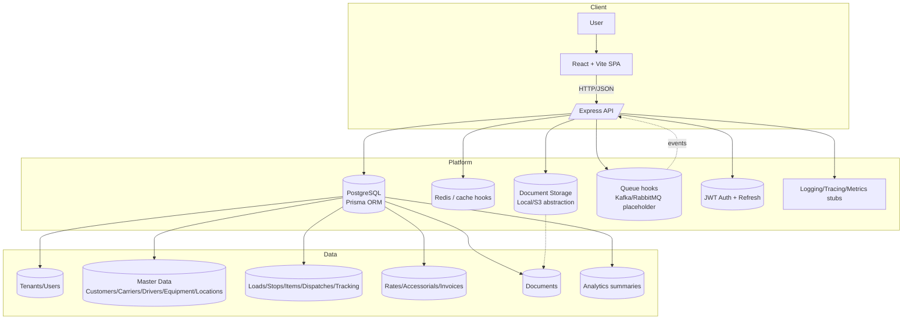

# FleetTMS

Multi-tenant Transportation Management System for shippers, brokers, and carriers. Monorepo with TypeScript backend (Express + Prisma) and React + Vite frontend.



## Project Structure
- `backend/` – Express API, Prisma schema/migrations, Jest tests
- `frontend/` – Vite + React app, Tailwind styling, Vitest tests
- `infra/` – Dockerfiles and docker-compose for local stack

## Getting Started (local)
1. Install dependencies per package:
   ```bash
   cd backend && npm install
   cd ../frontend && npm install
   ```
2. Start Postgres (local or via Docker `docker compose -f infra/docker-compose.yml up db`).
3. Env: copy `backend/.env.example` to `.env` and adjust `DATABASE_URL`/secrets.
4. DB: from `backend/` run:
   ```bash
   npx prisma migrate dev --name init
   npm run seed
   ```
5. Run backend: `npm run dev` (port 4000 by default).
6. Run frontend: `npm run dev` (port 5173, set `VITE_API_URL=http://localhost:4000/api/v1`).

## Docker (full stack)
```bash
docker compose -f infra/docker-compose.yml up --build
```
Backend on `:4000`, frontend on `:5173`.

## Demo credentials (seed)
- Tenant: `Acme Logistics`
- Users: `alice@acme.test`, `dan@acme.test`, `ivy@acme.test` with password `Password123!`

## Key API Endpoints (v1)
- Auth: `POST /auth/register`, `POST /auth/login`, `POST /auth/refresh`, `POST /auth/logout`, `GET /auth/me`
- Master data: CRUD for `/customers`, `/carriers`, `/drivers`, `/equipment`, `/locations`
- Loads: `POST /loads`, `GET /loads`, `GET /loads/:id`, `PUT /loads/:id`, `DELETE /loads/:id`, `POST /loads/:id/rate/calculate`, `POST /loads/:id/events`, `GET /loads/:id/events`, document upload/list
- Dispatch: `POST /dispatches/load/:loadId`, `POST /dispatches/:id/accept|reject|status`, `GET /dispatches`
- Billing: `GET /billing/invoices`, `POST /loads/:id/invoices`, `PUT /invoices/:id`
- Analytics: `GET /analytics/summary`

## Testing
- Backend: `cd backend && npm test`
- Frontend: `cd frontend && npm test`

## Notes
- JWT auth with tenant-aware scoping on all tenant resources.
- Prisma schema includes tenants, users, loads, dispatches, tracking events, billing, and documents with indices for `tenantId`.
- React frontend includes dashboard, loads, master data tables, billing, auth pages, and uses React Query for data fetching.
